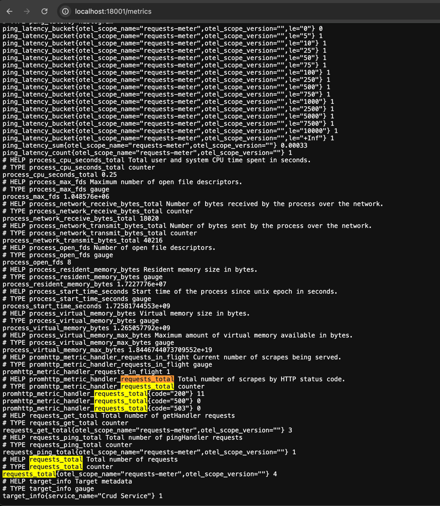
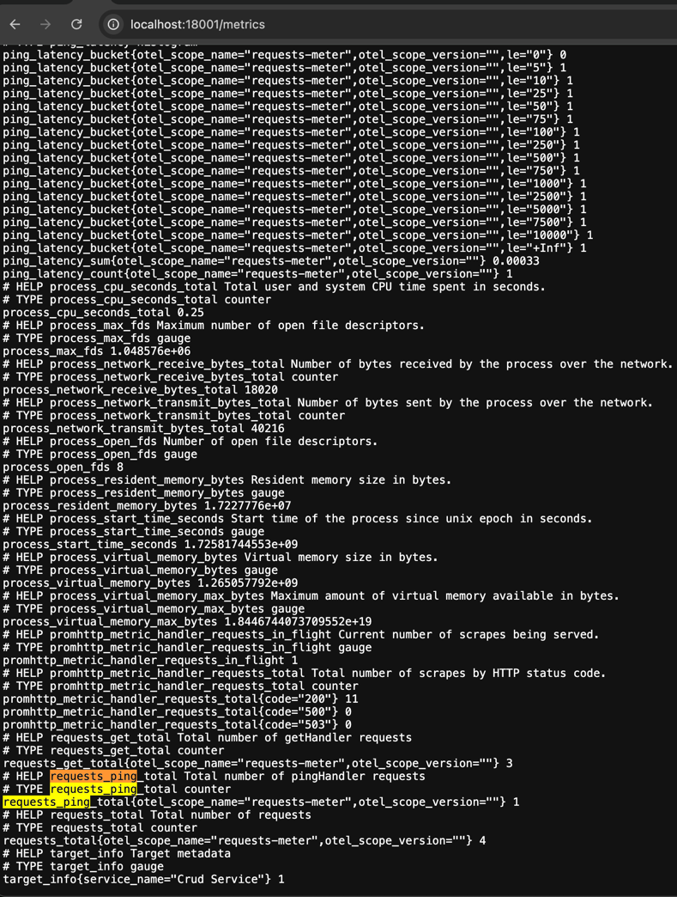
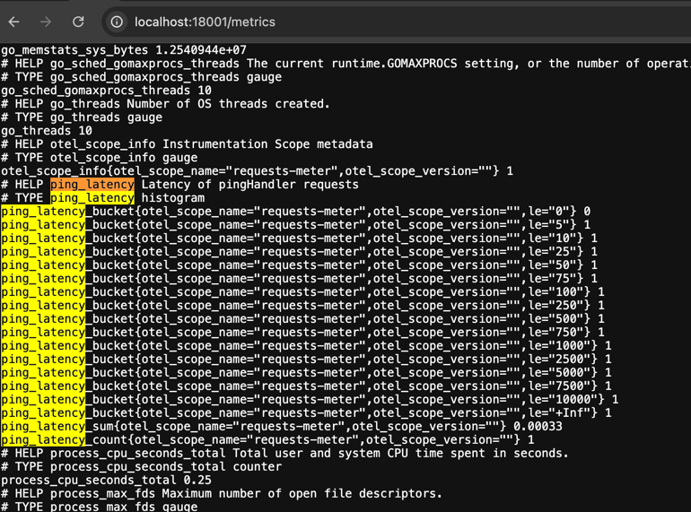
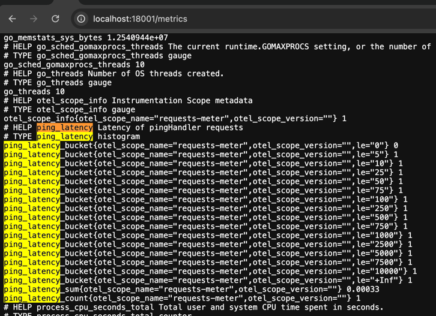
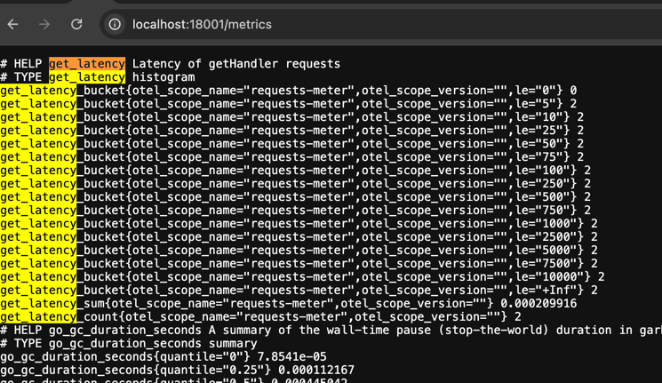

# Интеграция Prometheus

## Описание изменений:

1. В `docker-compose.yaml` добавил сервис Prometheus.
2. В `Makefile` добавил команду для проверки его доступности: `make check_prometheus`.
3. При инициализации проекта метрики экспортируются через эндпоинт `/metrics`, доступный для Prometheus.
4. Добавил несколько метрик:
    - **Общий счётчик запросов**:
        - Для всех запросов используется метрика `requests_total`.
    - **PingHandler**:
        - Добавлен счётчик запросов `requests_ping` для каждого запроса к `/ping`.
        - Добавлена гистограмма `ping_latency` для измерения времени обработки запросов.
    - **GetHandler**:
        - Добавлен счётчик запросов `requests_get` для каждого запроса к `/get`.
        - Добавлена гистограмма `get_latency` для измерения времени обработки запросов.

## Пример работы **requests_total**

## Пример работы **requests_ping**

## Пример работы **ping_latency**

## Пример работы **requests_get**

## Пример работы **get_latency**

