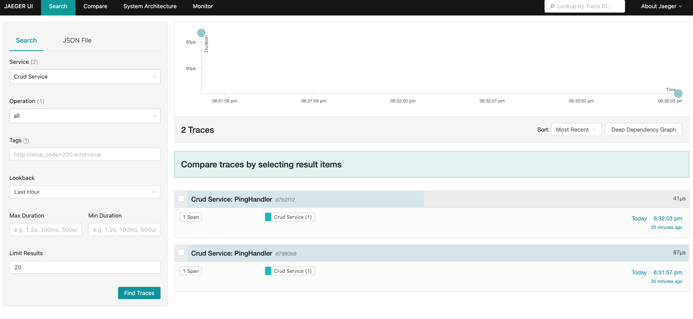
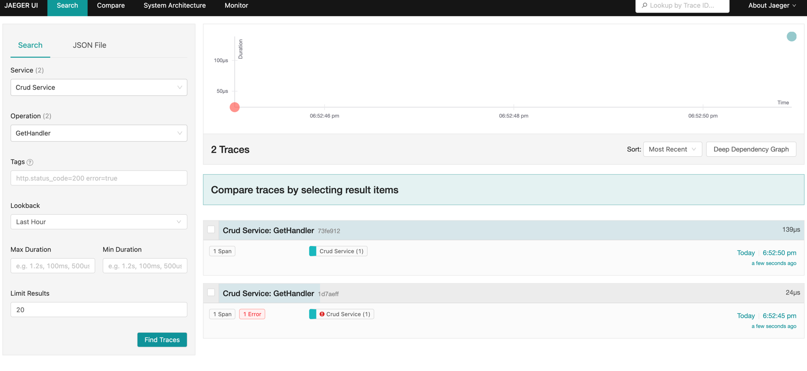
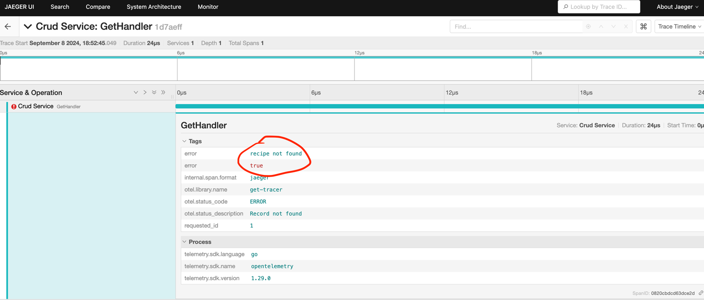
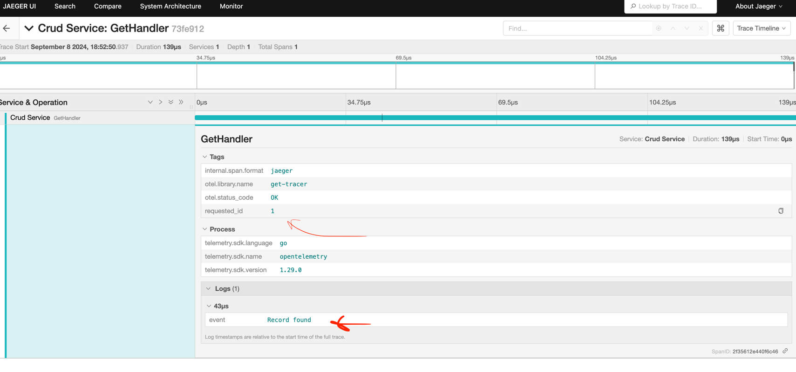

# Интеграция Jaeger

## Описание изменений:

1. В `docker-compose.yaml` добавил сервис Jaeger.
2. В `Makefile` добавил команду для проверки его доступности `make check_jaeger`.
3. При инициализации проекта указываю путь до Jaeger внутри сети Docker: `http://jaeger:14268/api/traces`.
4. Добавил два спана:
    - **PingHandler**: Простой спан для проверки отправки данных в Jaeger. Удобно проверять с помощью
      команды `make check` (сразу отправляется сообщение от PingHandler).
    - **GetHandler**:
        1. Записывает `id` искомой записи.
        2. Если запись не найдена, отправляет сообщение об ошибке.
        3. Если запись найдена, добавляет событие о её нахождении.
        4. Отправляет код статуса ответа в зависимости от результата.
## Пример работы в **PingHandler**:

Видим запросы после выполнения команды `make check:

## Пример работы в **GetHandler**:

Видим оба запроса:

Подробный отчет, когда запись не найдена:

Подробный отчет, когда запись найдена:

